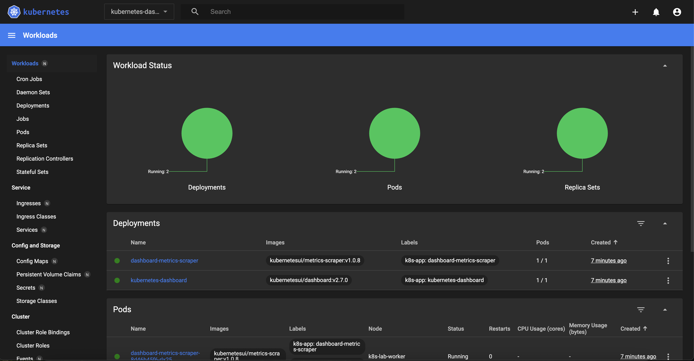

# Local Kubernetes Lab (kind + Docker)

A containerized Kubernetes environment running a 3-node cluster (1 control-plane + 2 workers) using [kind](https://kind.sigs.k8s.io/) inside Docker. Purpose-built for exploring Kubernetes networking, deployments, services, and internals on macOS.

## Architecture

```
┌─────────────────────────────────────────────────┐
│  macOS Host                                     │
│                                                 │
│  ┌────────────────────────────────────────────┐ │
│  │  k8s-lab container (Ubuntu 22.04)          │ │
│  │  • kubectl  • kind  • networking tools     │ │
│  │                                            │ │
│  │  ┌──────────────┐  ┌────────┐  ┌────────┐  │ │
│  │  │ control-plane│  │worker  │  │worker2 │  │ │
│  │  │ (k8s API,    │  │        │  │        │  │ │
│  │  │  etcd,       │  │        │  │        │  │ │
│  │  │  scheduler)  │  │        │  │        │  │ │
│  │  └──────────────┘  └────────┘  └────────┘  │ │
│  │         Docker "kind" bridge network       │ │
│  └────────────────────────────────────────────┘ │
│              /var/run/docker.sock (mounted)     │
└─────────────────────────────────────────────────┘
```

## Prerequisites

- [Docker Desktop for Mac](https://www.docker.com/products/docker-desktop/) (>= 4.x)
- Docker Desktop resource settings: **≥ 4 GB RAM**, **≥ 2 CPUs**

## Project Structure

```
k8s/
├── Dockerfile          # Ubuntu image with kubectl, kind, helm, and network tools
├── docker-compose.yml  # Compose service definition and port mappings
├── entrypoint.sh       # Bootstraps the kind cluster on container start
├── kind-config.yaml    # kind cluster topology (nodes, subnets, port mappings)
├── Makefile            # All lifecycle commands
├── assets/             # Screenshots and images for docs
├── manifests/          # YAML manifests — live-mounted at /workspace/manifests
│   ├── hello-api.yaml          # Hello World API (NodePort 30081)
│   ├── ngnix.yaml              # nginx web server (NodePort 30080)
│   └── dashboard-admin.yaml    # Dashboard admin ServiceAccount + token
└── README.md
```

## Quick Start

### Full workflow (2 commands)

```bash
make build    # 1. Build the Docker image (once)
make up       # 2. Start cluster + deploy everything + start port-forwards
```

`make up` automatically:
- Bootstraps the 3-node kind cluster
- Deploys nginx, Hello API, and Kubernetes Dashboard
- Patches dashboard for skip-login (no token required)
- Starts port-forwards as background Mac processes
- Prints a static dashboard token at the end

Everything is live when complete:

| Service | URL | Notes |
|---|---|---|
| Hello API | http://localhost:30081 | Returns `Hello from Kubernetes! 🚀` |
| nginx | http://localhost:30080 | nginx welcome page |
| Dashboard | https://localhost:8443 | Click **Skip** to bypass login |

Shut down and clean up everything:

```bash
make down
```

---

## All Make Targets

| Command | Description |
|---|---|
| `make build` | Build the Docker image |
| `make rebuild` | Force rebuild with no cache |
| `make up` | Start cluster + deploy manifests + start port-forwards |
| `make down` | Stop port-forwards + remove all containers + clean up |
| `make clean` | `down` + delete kubeconfig volume (full reset) |
| `make shell` | Attach interactive bash shell to the container |
| `make forward` | (Re)start all port-forwards in background |
| `make forward-stop` | Stop all port-forwards |
| `make deploy` | Re-apply all manifests (cluster must be running) |
| `make logs` | Tail container logs |
| `make k CMD="..."` | Run any kubectl command from your Mac |

```bash
# kubectl one-liners from your Mac
make k CMD="get nodes -o wide"
make k CMD="get po -A"
make k CMD="get svc"
make k CMD="scale deployment hello-api --replicas=4"
make k CMD="logs -l app=hello-api -f"
```

---

## Step-by-Step Guide

### Step 1 — Build the image

```bash
make build
```

Builds an Ubuntu 22.04 image with `kubectl`, `kind`, `helm`, Docker CLI, and networking tools pre-installed. Cached after the first run — only rebuilds when the Dockerfile changes.

```bash
make rebuild   # force a fresh build with no cache
```

---

### Step 2 — Start everything

```bash
make up
```

This single command (fully automatic, no Ctrl+C needed):
1. Cleans up any leftover kind containers from a previous run
2. Starts the `k8s-lab` container via `docker compose up -d`
3. Bootstraps a 3-node kind cluster (1 control-plane + 2 workers)
4. Polls until all nodes are `Ready` and CoreDNS is running
5. Applies all manifests in `manifests/` + installs Kubernetes Dashboard v2.7.0
6. Waits for all deployments to roll out
7. Patches dashboard to enable skip-login
8. Starts port-forwards as background Mac processes
9. Prints the static dashboard token

Expected final output:
```
  ✓ Cluster is up and running!
  ✓ hello-api  → http://localhost:30081
  ✓ nginx      → http://localhost:30080
  ✓ dashboard  → https://localhost:8443  (click 'Skip' to bypass login)

  Dashboard token (static, no expiry):
  eyJhbGci...
```

---

### Step 3 — Test

```bash
curl http://localhost:30081   # Hello from Kubernetes! 🚀
curl http://localhost:30080   # nginx welcome page
```

Open **https://localhost:8443** in your browser → accept the cert warning → click **Skip** to enter the dashboard without a token.

To log in with full admin access, paste the token printed by `make up` / `make deploy`.

---

### Step 4 — Shell in (optional)

```bash
make shell
```

Drops you into an interactive bash shell inside the `k8s-lab` container with `kubectl`, `helm`, `kind`, and all network tools on `$PATH`.

```bash
# Inside the shell
kubectl get nodes -o wide
kubectl get po -A
k get svc          # shorthand alias pre-configured
helm list -A
```

---

### Step 5 — Shut down

```bash
make down
```

Stops all port-forwards, removes the `k8s-lab` container, all kind node containers, and the kind Docker network. The built image is preserved so `make up` is fast next time.

```bash
make clean   # also deletes the kubeconfig volume (full reset)
```

---

### Option B — docker compose (manual)

If you prefer raw docker commands without `make`:

**Start:**
```bash
docker compose build
docker rm -f k8s-lab k8s-lab-control-plane k8s-lab-worker k8s-lab-worker2 2>/dev/null
docker network rm kind 2>/dev/null
docker compose up -d
docker logs -f k8s-lab   # watch bootstrap, Ctrl+C when done
```

**Deploy:**
```bash
docker exec k8s-lab kubectl apply -f /workspace/manifests/
docker exec k8s-lab kubectl apply -f https://raw.githubusercontent.com/kubernetes/dashboard/v2.7.0/aio/deploy/recommended.yaml
```

**Port-forwards (background Mac processes):**
```bash
docker exec k8s-lab kubectl port-forward --address 0.0.0.0 svc/hello-api 30081:80 &>/dev/null &
docker exec k8s-lab kubectl port-forward --address 0.0.0.0 svc/nginx 30080:80 &>/dev/null &
docker exec k8s-lab kubectl port-forward --address 0.0.0.0 -n kubernetes-dashboard svc/kubernetes-dashboard 8443:443 &>/dev/null &
```

**Shell:**
```bash
docker exec -it k8s-lab bash
```

**Shutdown:**
```bash
pkill -f "kubectl port-forward"
docker rm -f k8s-lab k8s-lab-control-plane k8s-lab-worker k8s-lab-worker2
docker network rm kind
docker compose down --remove-orphans
```

---

## Using kubectl

**From your Mac** — no shell needed:
```bash
make k CMD="cluster-info"
make k CMD="get nodes -o wide"
make k CMD="get po -A"
make k CMD="get svc"
```

**From inside the container** (`make shell`):
```bash
kubectl cluster-info
kubectl get nodes -o wide
kubectl get po -A
kubectl get svc

# Shorthand alias pre-configured
k get nodes
k get po -A
```

---

## Included Manifests

| File | What it deploys |
|---|---|
| [`manifests/hello-api.yaml`](manifests/hello-api.yaml) | Hello World API (2 replicas) → http://localhost:30081 |
| [`manifests/ngnix.yaml`](manifests/ngnix.yaml) | nginx web server (2 replicas) → http://localhost:30080 |
| [`manifests/dashboard-admin.yaml`](manifests/dashboard-admin.yaml) | Dashboard admin ServiceAccount + token |

Drop any additional YAML into `./manifests/` on your Mac — it's live-mounted at `/workspace/manifests` inside the container.

---

## Deploy & Test: Hello API

Manifest: [`manifests/hello-api.yaml`](manifests/hello-api.yaml) — 2 replicas of `hashicorp/http-echo` returning `Hello from Kubernetes! 🚀`.

```bash
# Deploy
make k CMD="apply -f /workspace/manifests/hello-api.yaml"

# Watch pods come up
make k CMD="get pods -l app=hello-api -w"

# Test from your Mac (after make forward)
curl http://localhost:30081
# Hello from Kubernetes! 🚀

# Test inside the cluster (ClusterIP, no port-forward needed)
make k CMD="run curl-test --image=curlimages/curl --rm -it --restart=Never -- curl -s http://hello-api:80"

# Rollout status
make k CMD="rollout status deployment/hello-api"

# Logs
make k CMD="logs -l app=hello-api -f"

# Scale
make k CMD="scale deployment hello-api --replicas=4"

# Teardown
make k CMD="delete -f /workspace/manifests/hello-api.yaml"
```

---

## Deploy & Test: nginx

Manifest: [`manifests/ngnix.yaml`](manifests/ngnix.yaml) — 2 replicas, NodePort 30080.

```bash
# Deploy
make k CMD="apply -f /workspace/manifests/ngnix.yaml"

# Watch pods
make k CMD="get pods -l app=nginx -w"

# Test from your Mac (after make forward)
curl http://localhost:30080

# Test inside the cluster
make k CMD="run curl-test --image=curlimages/curl --rm -it --restart=Never -- curl -s http://nginx:80"

# Logs
make k CMD="logs -l app=nginx"

# Teardown
make k CMD="delete -f /workspace/manifests/ngnix.yaml"
```

---

## Kubernetes Dashboard

A full web UI for your cluster — Kubernetes Dashboard v2.7.0.


*Workload status showing Deployments, Pods, and Replica Sets all running.*

> **`make up` handles everything automatically** — installs the dashboard, patches it for skip-login, starts the port-forward, and prints the static token.

### Access

Open **https://localhost:8443** in your browser.

- Accept the self-signed certificate warning (**Advanced → Proceed**)
- Click **Skip** to enter without a token (read-only safe)
- Or paste the static token (printed by `make up` / `make deploy`) for full admin access

### Get the static token any time

```bash
make k CMD="get secret admin-user-token -n kubernetes-dashboard -o jsonpath='{.data.token}'" | base64 -d && echo
```

### Restart the port-forward if dashboard becomes unreachable

```bash
make forward
```

### Teardown dashboard only

```bash
make k CMD="delete -f https://raw.githubusercontent.com/kubernetes/dashboard/v2.7.0/aio/deploy/recommended.yaml"
```

---

## Exploring the Network Layer

```bash
# See pod IPs and which node they're on
make k CMD="get po -A -o wide"

# See service ClusterIPs and NodePorts
make k CMD="get svc -A"

# Inspect the CNI (kindnet) networking on a node
make k CMD="describe node k8s-lab-control-plane"

# Look at iptables rules (kube-proxy) — runs directly on the kind node container
docker exec k8s-lab-control-plane iptables -t nat -L KUBE-SERVICES --line-numbers | head -30

# Routing table inside the kind control-plane node
docker exec k8s-lab-control-plane ip route

# DNS resolution inside the cluster
make k CMD="run dnstest --image=busybox --rm -it --restart=Never -- nslookup kubernetes.default"
```

---

## Exploring Core Components

```bash
# etcd — the cluster state store
make k CMD="get po -n kube-system"
make shell
# then inside the container:
kubectl exec -it etcd-k8s-lab-control-plane -n kube-system -- \
  etcdctl --endpoints=https://127.0.0.1:2379 \
  --cacert=/etc/kubernetes/pki/etcd/ca.crt \
  --cert=/etc/kubernetes/pki/etcd/server.crt \
  --key=/etc/kubernetes/pki/etcd/server.key \
  get / --prefix --keys-only | head -20

# API server logs
make k CMD="logs kube-apiserver-k8s-lab-control-plane -n kube-system --tail=20"

# Scheduler logs
make k CMD="logs kube-scheduler-k8s-lab-control-plane -n kube-system --tail=20"

# Controller manager logs
make k CMD="logs kube-controller-manager-k8s-lab-control-plane -n kube-system --tail=20"
```

---

## Cluster Configuration

Cluster topology is defined in [`kind-config.yaml`](kind-config.yaml):

| Setting | Value |
|---|---|
| Control-plane nodes | 1 |
| Worker nodes | 2 |
| Pod subnet | `10.244.0.0/16` |
| Service subnet | `10.96.0.0/12` |
| CNI | kindnet (default) |
| Kubernetes version | v1.35.0 |

To add more worker nodes, append to `kind-config.yaml`:
```yaml
  - role: worker
```
Then rebuild and restart.

To swap the CNI (e.g. install Calico for learning network policy), set `disableDefaultCNI: true` in `kind-config.yaml` and apply a CNI manifest after cluster creation.

---

## Installed Tools

| Tool | Purpose |
|---|---|
| `kubectl` | Kubernetes CLI |
| `helm` | Kubernetes package manager |
| `kind` | Cluster lifecycle management |
| `docker` (CLI) | Interact with host Docker daemon |
| `tcpdump` | Capture network traffic |
| `iproute2` / `ip` | Inspect routes, interfaces |
| `dnsutils` / `dig` | DNS debugging |
| `netstat` / `ss` | Socket and port inspection |
| `curl` | HTTP testing |
| `vim` | Edit files in-container |

---

## Troubleshooting

**Container exits immediately**
```bash
docker logs k8s-lab
```
Check for port conflicts or Docker socket permission issues.

**Port-forwards dropped / services unreachable**

Port-forwards run as background Mac processes (started by `make forward`). They die if the terminal session that started them is closed, or if the cluster restarts. Fix:
```bash
make forward
```

**Dashboard not accessible**
```bash
make forward   # restart all port-forwards
# then open https://localhost:8443 and click Skip
```
If the dashboard was just deployed, wait 30s for the pod to be fully Running:
```bash
make k CMD="get pods -n kubernetes-dashboard -w"
```

**`kubectl` connection refused inside container**
```bash
# Verify the container is on the kind network
docker network inspect kind | grep k8s-lab

# If missing, connect it
docker network connect kind k8s-lab

# Verify the kubeconfig has the right IP (not 127.0.0.1)
cat /root/.kube/config | grep server
```

**Port already allocated on start**
```bash
# Find what's using the port
lsof -i :6443

# Clean up and try again
make down && make up
```

**Node NotReady**
```bash
make k CMD="describe node <node-name>"
make k CMD="get events -A --sort-by=.lastTimestamp"
```

**Port-forwards silently not working**

All port-forwards run as background Mac processes via `make forward` (using `docker exec ... &`). They bind to `0.0.0.0` inside the container so traffic flows: `Mac:port → Docker port mapping → container port-forward → pod`. If you start them manually, always use `--address 0.0.0.0`:
```bash
docker exec k8s-lab kubectl port-forward --address 0.0.0.0 svc/hello-api 30081:80 &>/dev/null &
```
